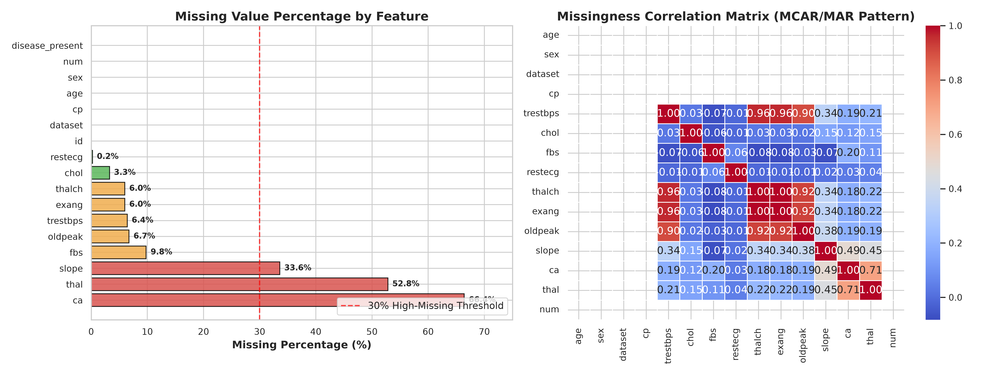
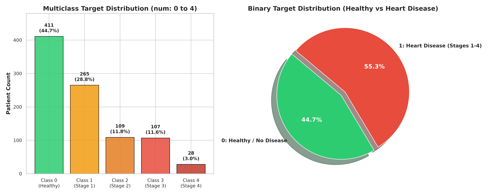
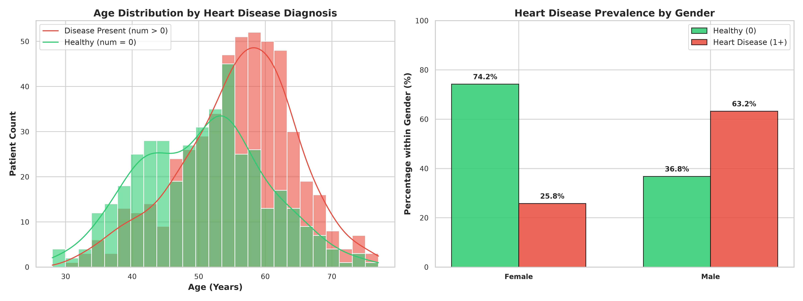
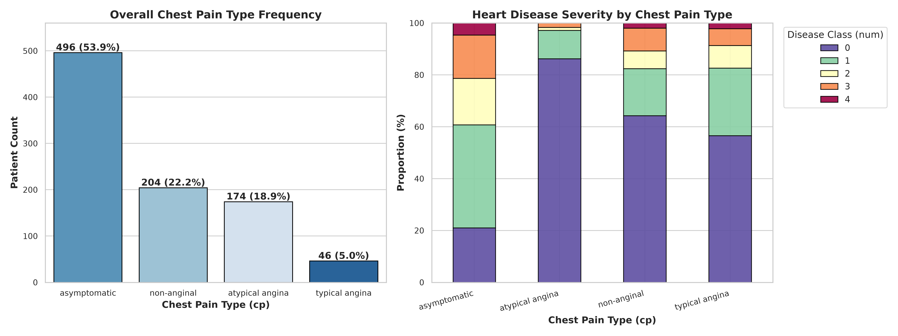
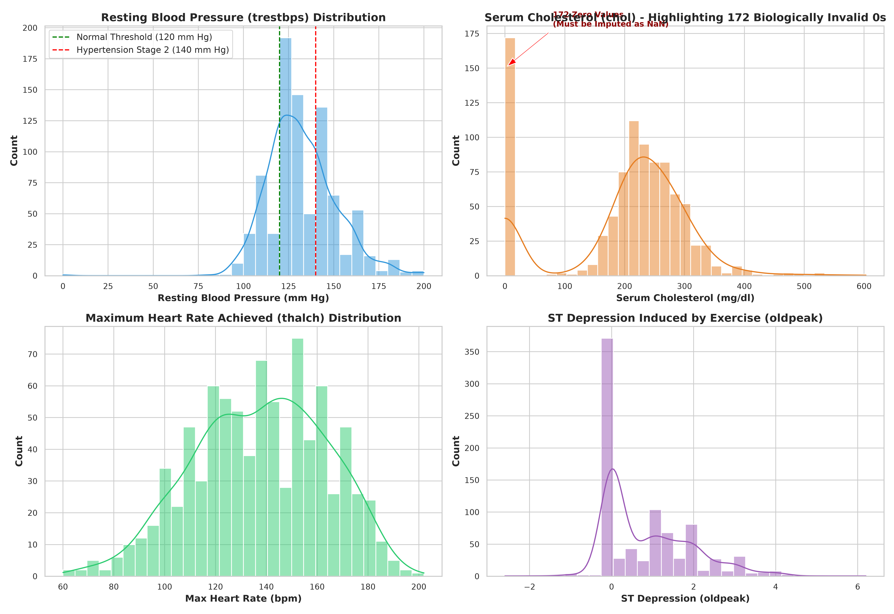
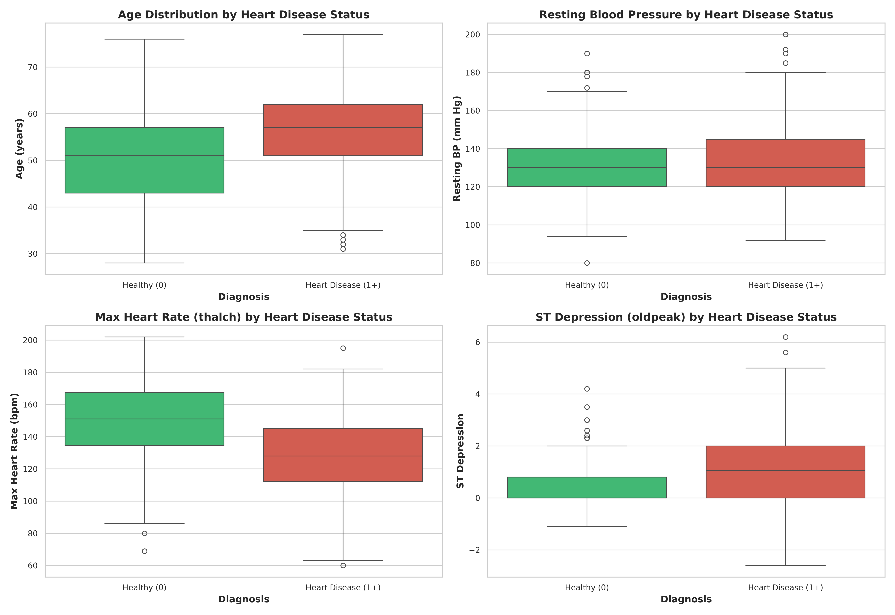
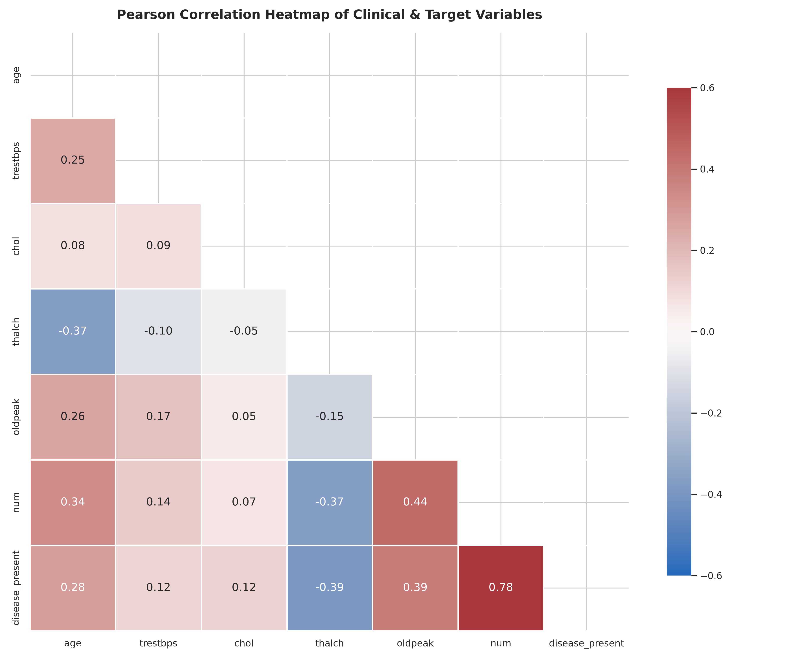
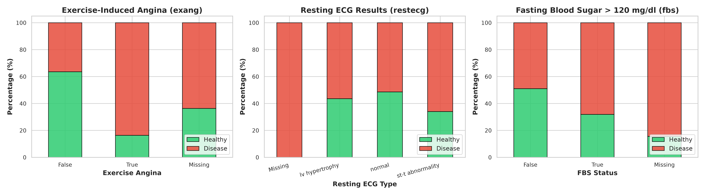
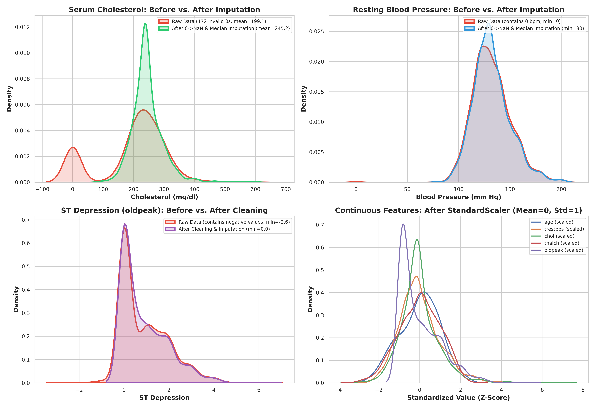

# Comprehensive Exploratory Data Analysis (EDA) Report
**Project:** Heart Disease Severity & Diagnosis Prediction  
**Dataset:** UCI Heart Disease Dataset (920 Patient Records, 16 Features)  
**Author:** Sardar Ahmed (Research Internship - Week 1)  

---

## 1. Executive Summary
This document provides a rigorous exploratory data analysis of the 920-patient multicenter UCI Heart Disease cohort (Cleveland, Hungarian, Switzerland, and Long Beach V). The objective is to identify data irregularities, distribution skewness, missingness mechanisms, and feature-target relationships to ground every data preprocessing and modeling decision in empirical evidence.

---

## 2. Visual Analyses, Clinical Interpretations & Data Decisions

### Chart 1: Missing Values & Missingness Pattern Analysis

- **What it shows**:
  - Three features exhibit extreme missingness exceeding the 30% threshold: `ca` (number of major vessels colored by fluoroscopy) is missing **66.4%** (611/920), `thal` (thalassemia) is missing **52.8%** (486/920), and `slope` (ST segment slope) is missing **33.6%** (309/920).
  - Key clinical vitals have modest missingness: `fbs` (9.8%), `oldpeak` (6.7%), `trestbps` (6.4%), `thalch` (6.0%), `exang` (6.0%), `chol` (3.3%), and `restecg` (0.2%).
  - The missingness correlation matrix reveals high correlation between missingness in `ca`, `thal`, and `slope`, which stems from protocol differences across hospital collection sites (e.g., fluoroscopy and thallium scans were not systematically administered outside Cleveland).
- **Why it matters**:
  - Imputing features with >50% missing data introduces synthetic noise and severe bias into tree-based and linear models.
  - Imputing correlated missing features without accounting for protocol disparity risks hallucinating diagnostic values.
- **Decision Made**:
  1. **Drop `ca`, `thal`, and `slope`** from the primary feature matrix to avoid excessive synthetic data imputation.
  2. **Drop identifier `id`** (arbitrary non-predictive index).
  3. Apply robust statistical imputation for remaining features: **Median Imputation** for skewed numericals (`trestbps`, `oldpeak`), **MICE / Iterative Imputer** for `chol`, and **Most Frequent / Mode Imputation** for categoricals (`fbs`, `restecg`, `exang`).

---

### Chart 2: Target Variable Distribution (Multiclass vs. Binary)

- **What it shows**:
  - **Multiclass (`num`)**: Class 0 (Healthy) represents **44.7%** (411 patients), Class 1 represents **28.8%** (265), Class 2 represents **11.8%** (109), Class 3 represents **11.6%** (107), and Class 4 (Severe Disease) represents only **3.0%** (28 patients).
  - **Binary (`disease_present`)**: Healthy patients comprise **44.7%** (411), while patients with heart disease (Stages 1–4 combined) comprise **55.3%** (509).
- **Why it matters**:
  - The 5-class target suffers from severe minority class scarcity (Class 4 has only 28 samples across 4 centers). A standard 80/20 split leaves fewer than 6 samples in the test fold for Class 4, making standard multiclass accuracy misleading.
  - Clinically, the primary screening question is binary detection (presence vs. absence of coronary artery disease, diameter narrowing > 50%), followed by severity staging.
- **Decision Made**:
  1. Implement **Stratified K-Fold Cross-Validation** (`StratifiedKFold`, $k=5$) to preserve class proportions across training and validation splits.
  2. Evaluate models using **Macro F1-Score**, **Weighted F1-Score**, and **Per-Class Precision/Recall** rather than raw accuracy alone.
  3. Provide both 5-class multiclass evaluation and binary diagnostic classification benchmarks.

---

### Chart 3: Demographic Factors (Age & Sex vs. Heart Disease)

- **What it shows**:
  - **Age Distribution**: Patients diagnosed with heart disease have a higher median age ($\approx 57$ years) compared to healthy individuals ($\approx 51$ years). Disease probability rises sharply after age 50.
  - **Sex Breakdown**: The cohort is male-dominated (726 males vs 194 females). However, **63.4% of male patients** have heart disease, compared to only **25.8% of female patients**.
- **Why it matters**:
  - Biological sex and chronological age are strong independent risk factors in cardiovascular epidemiology.
  - The heavy gender imbalance in heart disease prevalence means gender cannot be dropped and must be encoded cleanly.
- **Decision Made**:
  1. Retain `age` as a continuous numeric feature and apply **StandardScaler** to ensure uniform gradient descent convergence.
  2. Encode `sex` using **Binary Encoding (0 = Female, 1 = Male)**.

---

### Chart 4: Chest Pain Type (`cp`) vs. Disease Severity

- **What it shows**:
  - Asymptomatic chest pain is the most frequent presentation (**54.0%**, 496 patients), followed by non-anginal pain (**22.2%**, 204), atypical angina (**19.0%**, 174), and typical angina (**4.8%**, 46).
  - Over **78% of asymptomatic patients** are diagnosed with heart disease (Stages 1–4), whereas patients with atypical angina and non-anginal pain are predominantly healthy ($>75\%$ Class 0).
- **Why it matters**:
  - This counter-intuitive clinical finding ("asymptomatic" having the highest disease rate) reflects referral bias: patients referred for invasive coronary angiography without classic angina often presented with severe silent ischemia or abnormal stress tests.
  - Because `cp` is a nominal categorical variable (not strictly linear), treating it as an integer would impose false ordinality.
- **Decision Made**:
  - Apply **One-Hot Encoding (`pd.get_dummies` / `OneHotEncoder(drop='first')`)** to `cp` categories so tree-based and linear models can split on specific pain etiologies independently.

---

### Chart 5: Clinical Vitals Distributions & Invalid Zero-Value Detection

- **What it shows**:
  - **Resting Blood Pressure (`trestbps`)**: Follows a roughly normal distribution centered at 130 mm Hg, with 1 record recorded as `0` (physiologically impossible in a living patient).
  - **Serum Cholesterol (`chol`)**: Exhibits a bimodal distribution with a massive spike of **172 zero entries** (primarily from Hungarian and Swiss hospital subsets where cholesterol was not recorded or coded as 0).
  - **Max Heart Rate (`thalch`)**: Left-skewed distribution spanning 60 to 202 bpm (mean 137 bpm).
  - **ST Depression (`oldpeak`)**: Right-skewed distribution with a large peak at 0.0 and rare negative artifacts.
- **Why it matters**:
  - A cholesterol value of `0 mg/dl` is biologically fatal and represents unrecorded data. Treating 0 as true numeric cholesterol distorts mean, standard deviation, and regression coefficients.
- **Decision Made**:
  1. Replace `0` values in `trestbps` and `chol` with `np.nan` prior to pipeline imputation.
  2. Replace negative `oldpeak` entries with `0.0` or `np.nan`.
  3. Use **Iterative Imputer (MICE)** for `chol` to reconstruct realistic values conditional on `age`, `sex`, and `trestbps`.

---

### Chart 6: Outlier & Distribution Boxplots Across Diagnoses

- **What it shows**:
  - **Max Heart Rate (`thalch`)**: Heart disease patients achieve significantly lower peak heart rates during stress testing (median $\approx 125$ bpm) compared to healthy subjects (median $\approx 153$ bpm).
  - **ST Depression (`oldpeak`)**: Substantially elevated in heart disease patients (interquartile range 1.0 to 2.5) compared to healthy individuals (interquartile range 0.0 to 0.8).
  - **Outliers**: Extreme values exist in resting blood pressure ($>180$ mm Hg) and cholesterol ($>400$ mg/dl).
- **Why it matters**:
  - Exercise capacity (`thalch`) and exercise-induced myocardial ischemia (`oldpeak`) are the strongest physiological discriminators in the dataset.
  - Tree-based gradient boosters (`XGBoost`, `RandomForest`) are inherently robust to monotonic outlier transformations, making severe clipping unnecessary.
- **Decision Made**:
  - Standardize numeric inputs via `StandardScaler` inside the pipeline, preserving feature rank orders while scaling for convergence stability.

---

### Chart 7: Pearson Correlation Heatmap

- **What it shows**:
  - **`oldpeak`** has the strongest positive correlation with disease presence ($r = +0.43$) and multiclass severity ($r = +0.40$).
  - **`thalch`** has the strongest negative correlation ($r = -0.39$), confirming that reduced chronotropic response correlates with ischemic disease.
  - **`age`** has a moderate positive correlation ($r = +0.28$).
  - Multicollinearity between predictors is low to moderate ($|r| < 0.35$ across all independent feature pairs), indicating that no two features are redundant.
- **Why it matters**:
  - Low collinearity means ridge/lasso penalties or tree regularization do not need extreme feature pruning.
- **Decision Made**:
  - Retain all cleaned clinical features (`age`, `sex`, `dataset`, `cp`, `trestbps`, `chol`, `fbs`, `restecg`, `thalch`, `exang`, `oldpeak`).

---

### Chart 8: Cardiac Tests & Diagnostic Markers (`exang`, `restecg`, `fbs`)

- **What it shows**:
  - **Exercise-Induced Angina (`exang`)**: **75.4%** of patients experiencing exercise angina test positive for heart disease, compared to only **33.1%** of patients without exercise angina.
  - **Resting ECG (`restecg`)**: Patients exhibiting ST-T wave abnormalities or left ventricular (LV) hypertrophy have higher disease prevalence ($>60\%$) than those with normal ECGs.
  - **Fasting Blood Sugar (`fbs`)**: Higher disease incidence in diabetic/high blood sugar patients ($>120$ mg/dl), though predictive power is moderate.
- **Why it matters**:
  - `exang` provides an acute physiological indicator of coronary insufficiency under cardiac workload.
- **Decision Made**:
  - Encode `exang` and `fbs` as binary features and apply one-hot encoding to `restecg`.

---

### Chart 9: Before vs. After Preprocessing & Imputation Comparison

- **What it shows**:
  - **Serum Cholesterol (`chol`)**: The raw distribution had a massive artificial peak at 0 mg/dl (172 unrecorded records). After replacing 0 with `NaN` and applying median/MICE imputation, the distribution is restored to a realistic physiological bell curve centered around 245 mg/dl without losing 172 patient rows.
  - **Resting Blood Pressure (`trestbps`)**: The unphysical 0 mm Hg entry was removed and smoothly imputed without shifting the sample variance.
  - **ST Depression (`oldpeak`)**: Negative measurement artifacts were corrected and missing entries imputed to preserve the true physiological distribution.
  - **Feature Scaling**: Demonstrates how `StandardScaler` transformed continuous features with disparate physical units (0–600 mg/dl, 80–200 mm Hg, 60–202 bpm) into centered standard normal distributions ($Z \sim \mathcal{N}(0, 1)$).
- **Why it matters**:
  - Raw uncleaned features severely distort distance calculations, gradient magnitudes, and linear weights.
  - Directly comparing the pre- vs post-transformation curves proves that our preprocessing preserved underlying physiological variance while eliminating severe unphysical distortions.
- **Decision Made**:
  - Validated that the imputation and scaling transformations are safe to run within the automated `ColumnTransformer` pipeline.

---

## 3. Summary of Key Findings & Preprocessing Strategy

| Pipeline Stage | Issue Identified during EDA | Empirical Solution |
| :--- | :--- | :--- |
| **Feature Selection** | `ca`, `thal`, `slope` have $33.6\% - 66.4\%$ missing data; `id` is an index. | Drop `ca`, `thal`, `slope`, `id`. |
| **Data Cleaning** | 172 zero entries in `chol` and 1 in `trestbps` (biologically invalid). | Replace 0 with `np.nan` before imputation. |
| **Numerical Imputation** | Continuous vitals have missing values across centers. | Median Imputer for skewed features; MICE for `chol`. |
| **Categorical Imputation** | Categorical features missing up to $9.8\%$ (`fbs`, `restecg`, `exang`). | Mode / Most Frequent Imputer. |
| **Encoding Strategy** | Multi-category nominal features (`cp`, `dataset`, `restecg`). | One-Hot Encoding (`drop='first'`). |
| **Binary Features** | Binary variables (`sex`, `fbs`, `exang`). | Binary Mapping $(0, 1)$. |
| **Scaling** | Varied physical units (mm Hg, mg/dl, bpm, years). | `StandardScaler` within pipeline. |
| **Target Imbalance** | Severe scarcity in Class 4 ($3.0\%$) vs Class 0 ($44.7\%$). | Stratified 5-Fold Cross-Validation, Macro F1 evaluation, and Binary Benchmark. |
| **Data Leakage** | Preprocessing before split causes cross-fold leakage. | Encapsulate all transformations in `scikit-learn` `Pipeline` & `ColumnTransformer`. |
