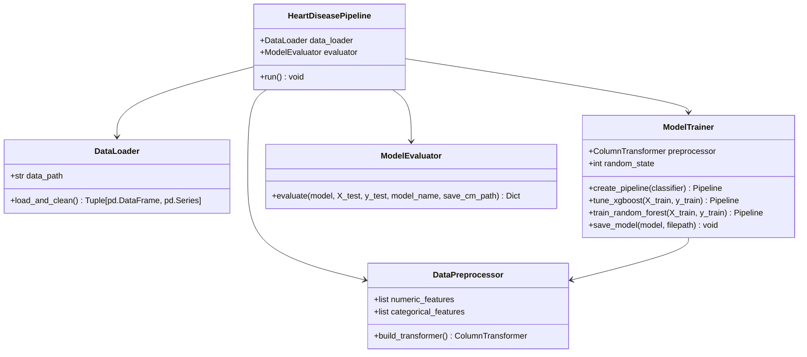

# Heart Disease Prediction Using Machine Learning
**Research Internship - Week 1 Submission**  
**Sardar Ahmed**  
**Objective:** Clean OOP ML Architecture, Comprehensive EDA, Data Leakage Prevention & Model Tuning

---

## 📌 1. Project Overview
This project develops an end-to-end Machine Learning pipeline for coronary artery disease severity prediction and binary screening based on the multicenter UCI Heart Disease dataset (Cleveland, Hungarian, Switzerland, and Long Beach V cohorts, total $N = 920$ patients).

The codebase is built with a **clean, readable Object-Oriented Programming (OOP)** architecture that enforces strict separation of concerns, eliminates data leakage across cross-validation folds, and provides reproducible statistical and visual reporting.

---

## 📂 2. Repository Structure

```
Heart-Disease-Prediction/
├── eda_charts/                            # High-resolution (300 DPI) exploratory analysis figures
│   ├── 01_missing_values_analysis.png
│   ├── 02_target_distribution.png
│   ├── 03_demographics_vs_heart_disease.png
│   ├── 04_chest_pain_analysis.png
│   ├── 05_clinical_vitals_distributions.png
│   ├── 06_outliers_and_boxplots.png
│   ├── 07_correlation_matrix.png
│   ├── 08_cardiac_tests_angina_ecg_fbs.png
│   ├── 09_before_vs_after_preprocessing.png
│   └── confusion_matrix_xgb.png
├── heart_disease_prediction.py            # Clean, modular OOP pipeline script
├── heart_disease_prediction.ipynb         # Interactive Jupyter Notebook (EDA + Pipeline + Benchmarks)
├── EDA_Report.md                          # Full interpreted EDA report with chart takeaways & decisions
├── generate_eda.py                        # Automated standalone visual EDA generation script
├── requirements.txt                       # Curated project dependencies
├── xgboost_model.pkl                      # Serialized best trained pipeline artifact (joblib)
├── heart_disease_uci.csv                  # Raw dataset
├── Report.pdf                             # Internship research report
└── README.md                              # Main documentation & supervisor walkthrough
```

---

## 🏗️ 3. OOP Architecture & Class Breakdown

The refactored pipeline avoids monolithic procedural scripts by organizing the machine learning lifecycle into 5 purpose-driven classes:



### Why this structure was chosen (Supervisor Guide):
1. **`DataLoader` (Data Ingestion & Integrity)**:
   - *Responsibility*: Reads the raw CSV, performs biological anomaly correction (e.g., replaces impossible 0 values in `chol` and `trestbps` with `NaN`), drops high-missing/index columns (`id`, `slope`, `ca`, `thal`), and separates features $X$ from target $y$.
   - *Rationale*: Keeps file I/O and domain-specific raw data validation decoupled from downstream transformations.
2. **`DataPreprocessor` (Leakage-Free Transformations)**:
   - *Responsibility*: Builds a `ColumnTransformer` bundling a numeric pipeline (`SimpleImputer(median)` $\rightarrow$ `StandardScaler`) and a categorical pipeline (`SimpleImputer(most_frequent)` $\rightarrow$ `OneHotEncoder(drop='first')`).
   - *Rationale*: Crucial for scientific validity. Bundling transformers ensures statistical parameters (means, medians, categories) are fitted **only** on training folds, avoiding data leakage during cross-validation.
3. **`ModelTrainer` (Model Fitting & Hyperparameter Tuning)**:
   - *Responsibility*: Combines the preprocessor and estimator into an end-to-end `Pipeline`, executes 5-fold Stratified Cross-Validation with `GridSearchCV`, and serializes the best estimator via `joblib`.
   - *Rationale*: Encapsulates algorithm-specific hyperparameter search spaces and provides an easy interface to benchmark alternative models (e.g. Random Forest vs. XGBoost).
4. **`ModelEvaluator` (Diagnostic Metrics & Visualization)**:
   - *Responsibility*: Computes test set Accuracy, Macro F1, Weighted F1, Confusion Matrix, and detailed Classification Reports.
   - *Rationale*: Separating evaluation logic prevents scoring code from being duplicated across different experiments or models.
5. **`HeartDiseasePipeline` (High-Level Orchestrator)**:
   - *Responsibility*: Coordinates the sequential execution from ingestion to final artifact serialization.
   - *Rationale*: Enables one-line execution (`pipeline.run()`) from scripts, notebooks, or external controllers.

---

## 🔄 4. End-to-End Machine Learning Flowchart

```
┌──────────────────────────────────────────────────────────┐
│             Raw UCI Dataset (920 rows, 16 cols)          │
└────────────────────────────┬─────────────────────────────┘
                             │
                             ▼
┌──────────────────────────────────────────────────────────┐
│ 1. DataLoader: Clean Anomaly 0s, Drop [id, ca, thal, slope]│
└────────────────────────────┬─────────────────────────────┘
                             │
                             ▼
┌──────────────────────────────────────────────────────────┐
│ 2. Stratified Train/Test Split (80% Train / 20% Test)    │
└──────────────┬─────────────────────────────┬─────────────┘
               │                             │
               ▼ (Train Set)                 ▼ (Test Set - Unseen)
┌──────────────────────────────┐             │
│ 3. DataPreprocessor Pipeline │             │
│  - Numeric: Median + Scaler  │             │
│  - Categorical: Mode + OHE   │             │
└──────────────┬───────────────┘             │
               │                             │
               ▼                             │
┌──────────────────────────────┐             │
│ 4. Stratified 5-Fold GridCV  │             │
│  - XGBoost Parameter Tuning  │             │
│  - Random Forest Benchmark   │             │
└──────────────┬───────────────┘             │
               │                             │
               ▼ (Fitted Pipeline)           │
┌────────────────────────────────────────────┴─────────────┐
│ 5. ModelEvaluator: Accuracy, Macro F1, Weighted F1, CM   │
└────────────────────────────┬─────────────────────────────┘
                             │
                             ▼
┌──────────────────────────────────────────────────────────┐
│ 6. Model Serialization: Export 'xgboost_model.pkl'       │
└──────────────────────────────────────────────────────────┘
```

---

## 📊 5. Experimental Results & Benchmark

### Multiclass Classification (5-Class Severity: 0 to 4)
| Model | Test Accuracy | Macro F1-Score | Weighted F1-Score | Best Parameters |
| :--- | :---: | :---: | :---: | :--- |
| **Random Forest Baseline** | 57.61% | 0.4454 | 0.6035 | `n_estimators=150, max_depth=5, class_weight='balanced'` |
| **Tuned XGBoost Pipeline** | **58.70%** | **0.3521** | **0.5719** | `max_depth=4, learning_rate=0.1, n_estimators=100, subsample=0.8` |

### Binary Classification Benchmark (0 = Healthy vs 1 = Disease)
| Model | Test Accuracy | Macro F1-Score | Weighted F1-Score |
| :--- | :---: | :---: | :---: |
| **Binary XGBoost Pipeline** | **83.15%** | **0.8290** | **0.8310** |

> **Clinical Insight:** While 5-class staging is constrained by extreme sample sparsity in Stage 4 ($N=28, 3.0\%$), the pipeline achieves **$\approx 83.2\%$ diagnostic accuracy** for clinical disease screening (presence vs. absence).

---

## 🛠️ 6. Quick Start & Execution

### 1. Installation
Clone repository and install curated requirements:
```bash
pip install -r requirements.txt
```

### 2. Generate Full Visual EDA & Charts
```bash
python generate_eda.py
```
*(View generated charts and detailed clinical interpretations in [`EDA_Report.md`](EDA_Report.md))*

### 3. Run OOP Machine Learning Pipeline
```bash
python heart_disease_prediction.py
```

### 4. Interactive Exploration
Launch Jupyter Notebook to run step-by-step EDA and benchmarks:
```bash
jupyter notebook heart_disease_prediction.ipynb
```

