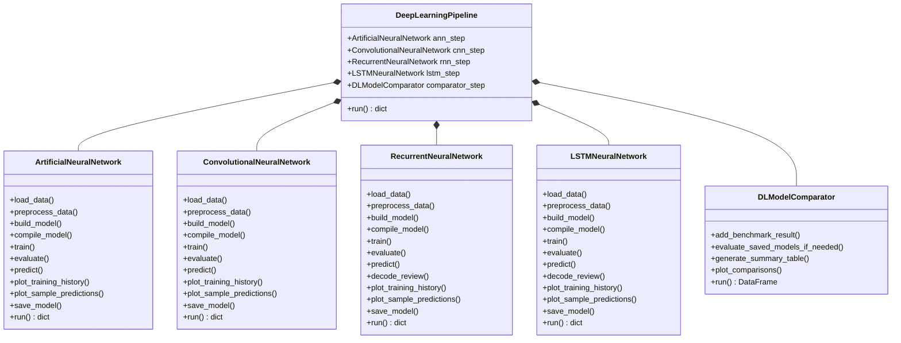

# Deep Learning Architectures Benchmark & Object-Oriented Framework
**Research Internship — Week 2 Submission**  
**Author:** Sardar Ahmed  
**Institution/Company:** Alphatron Technologies  
**Structure:** 5-Step Modular Deep Learning Pipeline with Master Orchestrator (`Main.py`)

---

## 📌 1. Project Overview

This project delivers a modular, production-ready, Object-Oriented Deep Learning benchmark suite evaluating four foundational neural network paradigms across Computer Vision and Natural Language Processing tasks:
1. **Artificial Neural Network (ANN / Multi-Layer Perceptron):** Baseline feedforward classifier for MNIST handwritten digit recognition.
2. **Convolutional Neural Network (CNN):** Spatial inductive bias with 2D convolutions, max pooling, and dropout regularization for MNIST.
3. **Recurrent Neural Network (SimpleRNN):** Sequential recurrent hidden state dynamics for IMDB movie review sentiment classification.
4. **Long Short-Term Memory (LSTM):** Gated recurrent memory architecture (Forget, Input, Candidate, Output gates) for long-sequence sentiment classification.

The repository is organized into **5 decoupled, single-responsibility Python modules (`Step_1_ANN.py` to `Step_5_Model_Comparison.py`)** coordinated by a master orchestrator (`Main.py`), featuring dedicated artifact directories (`Models/`, `Visualizations/`, `ModelComparison/`), high-resolution visualization generators, and automated benchmark reporting.

---

## 📂 2. Repository & Output Folder Structure

```
Week 2/
├── Models/                                  # Serialized Trained Model Artifacts (.keras)
│   ├── ann_mnist_model.keras
│   ├── cnn_mnist_model.keras
│   ├── rnn_imdb_model.keras
│   └── lstm_imdb_model.keras
├── Visualizations/                          # Training curves, sample predictions, confusion matrices
│   ├── ann_training_history.png
│   ├── ann_sample_predictions.png
│   ├── cnn_training_history.png
│   ├── cnn_sample_predictions.png
│   ├── rnn_training_history.png
│   ├── rnn_sample_predictions.png
│   ├── lstm_training_history.png
│   └── lstm_sample_predictions.png
├── ModelComparison/                         # Comparative Benchmarks & Charts
│   ├── deep_learning_benchmark_results.csv
│   ├── vision_models_comparison.png
│   ├── sequence_models_comparison.png
│   └── overall_dl_benchmark_comparison.png
│
├── Step_1_ANN.py                            # class ArtificialNeuralNetwork: MNIST MLP pipeline
├── Step_2_CNN.py                            # class ConvolutionalNeuralNetwork: MNIST 2D CNN pipeline
├── Step_3_RNN.py                            # class RecurrentNeuralNetwork: IMDB SimpleRNN sequence pipeline
├── Step_4_LSTM.py                           # class LSTMNeuralNetwork: IMDB LSTM sequential memory pipeline
├── Step_5_Model_Comparison.py               # class DLModelComparator: Cross-architecture benchmarking & evaluation
├── Main.py                                  # class DeepLearningPipeline: Master OOP orchestrator
│
├── ANN.py                                   # Seamless entry point / alias to Step_1_ANN
├── CNN.py                                   # Seamless entry point / alias to Step_2_CNN
├── RNN.py                                   # Seamless entry point / alias to Step_3_RNN
├── LSTM.py                                  # Seamless entry point / alias to Step_4_LSTM
│
├── DeepLearningImplementations.ipynb        # Master Interactive Jupyter Notebook
├── README.md                                # Full Project Documentation & Mermaid Diagrams
├── Documentation.md                         # Detailed Architectural & Mathematical Breakdown
├── flowchart_Task2_Sardar_Ahmed_Deep_Learning_Architectures.pdf # 5-Step OOP pipeline flowchart PDF
├── Report.pdf                               # Formal Publication-Ready PDF Report
└── requirements.txt                         # Dependency specifications
```

---

## 🏛️ 3. Pure Object-Oriented (OOP) Architecture

The pipeline is engineered with **5 dedicated, single-responsibility Python classes**:



---

## 🔬 4. Step-by-Step Module Breakdown

### Step 1: Artificial Neural Network (`Step_1_ANN.py`)
- **Class:** `ArtificialNeuralNetwork`
- **Dataset:** MNIST ($28 \times 28$ grayscale digits)
- **Architecture:** `Flatten(input_shape=(28,28))` $\rightarrow$ `Dense(128, ReLU)` $\rightarrow$ `Dense(64, ReLU)` $\rightarrow$ `Dense(10, Softmax)`
- **Artifacts:** `Models/ann_mnist_model.keras`, `Visualizations/ann_training_history.png`, `Visualizations/ann_sample_predictions.png`

### Step 2: Convolutional Neural Network (`Step_2_CNN.py`)
- **Class:** `ConvolutionalNeuralNetwork`
- **Dataset:** MNIST ($N \times 28 \times 28 \times 1$)
- **Architecture:** `Conv2D(32, 3x3, ReLU)` $\rightarrow$ `MaxPool(2x2)` $\rightarrow$ `Conv2D(64, 3x3, ReLU)` $\rightarrow$ `MaxPool(2x2)` $\rightarrow$ `Flatten` $\rightarrow$ `Dense(128, ReLU)` $\rightarrow$ `Dropout(0.5)` $\rightarrow$ `Dense(10, Softmax)`
- **Artifacts:** `Models/cnn_mnist_model.keras`, `Visualizations/cnn_training_history.png`, `Visualizations/cnn_sample_predictions.png`

### Step 3: Recurrent Neural Network (`Step_3_RNN.py`)
- **Class:** `RecurrentNeuralNetwork`
- **Dataset:** IMDB Movie Reviews (10,000 vocab, padded to 200 tokens)
- **Architecture:** `Embedding(10000 -> 32)` $\rightarrow$ `SimpleRNN(64)` $\rightarrow$ `Dense(1, Sigmoid)`
- **Artifacts:** `Models/rnn_imdb_model.keras`, `Visualizations/rnn_training_history.png`, `Visualizations/rnn_sample_predictions.png`

### Step 4: Long Short-Term Memory (`Step_4_LSTM.py`)
- **Class:** `LSTMNeuralNetwork`
- **Dataset:** IMDB Movie Reviews (10,000 vocab, padded to 200 tokens)
- **Architecture:** `Embedding(10000 -> 64)` $\rightarrow$ `LSTM(64)` $\rightarrow$ `Dense(1, Sigmoid)`
- **Artifacts:** `Models/lstm_imdb_model.keras`, `Visualizations/lstm_training_history.png`, `Visualizations/lstm_sample_predictions.png`

### Step 5: Model Comparison & Benchmarking (`Step_5_Model_Comparison.py`)
- **Class:** `DLModelComparator`
- **Benchmark Metrics:** Accuracy, Loss, Total Parameters, Training Time
- **Artifacts:** `ModelComparison/deep_learning_benchmark_results.csv`, `ModelComparison/vision_models_comparison.png`, `ModelComparison/sequence_models_comparison.png`, `ModelComparison/overall_dl_benchmark_comparison.png`

---

## 📊 5. Empirical Benchmark Results

| Model Architecture | Task Domain | Dataset | Parameters | Test Accuracy | Test Loss |
| :--- | :--- | :--- | :---: | :---: | :---: |
| **Artificial Neural Network (ANN)** | Computer Vision | MNIST | 109,386 | **97.30%** | 0.1149 |
| **Convolutional Neural Network (CNN)** | Computer Vision | MNIST | 225,034 | **99.22%** | 0.0272 |
| **Recurrent Neural Network (SimpleRNN)** | NLP Sentiment | IMDB | 326,273 | **72.16%** | 0.5605 |
| **Long Short-Term Memory (LSTM)** | NLP Sentiment | IMDB | 673,089 | **84.85%** | 0.4169 |

---

## 🚀 6. How to Run

### 1. Execute the Master Pipeline
```bash
python Main.py
```

### 2. Execute Any Step Standalone
```bash
python Step_1_ANN.py
python Step_2_CNN.py
python Step_3_RNN.py
python Step_4_LSTM.py
python Step_5_Model_Comparison.py
```

### 3. Run Interactive Jupyter Notebook
```bash
jupyter lab DeepLearningImplementations.ipynb
```
