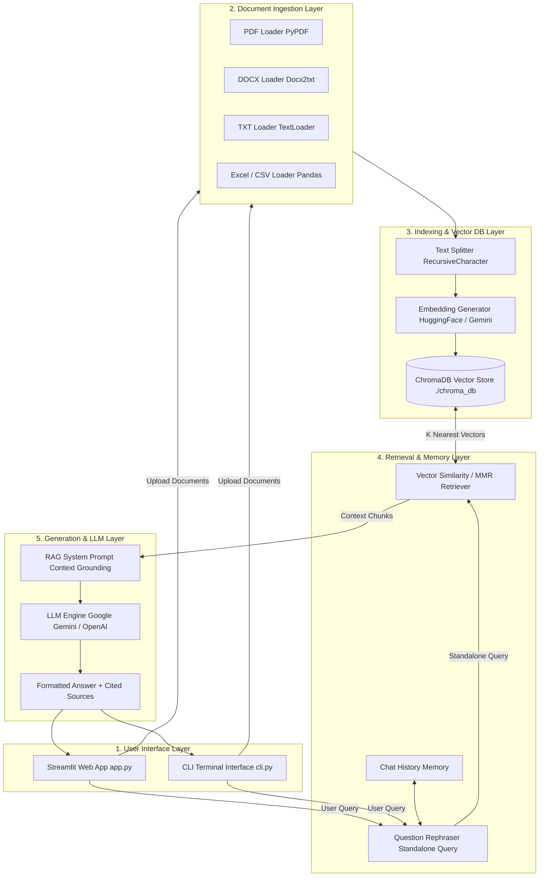

# RAG AI Chatbot - Architecture Diagram

The system architecture consists of 5 modular layers:
1. **User Interface Layer**: Streamlit Web UI and CLI Terminal Interface.
2. **Document Ingestion Layer**: Multi-format loaders (PDF, DOCX, TXT, Excel/CSV).
3. **Indexing & Vector DB Layer**: Recursive Character Chunking, Embedding Models (HuggingFace/Google/OpenAI), and persistent ChromaDB storage.
4. **Retrieval & Memory Layer**: Conversational Query Rephrasing, Top-K Similarity / MMR search, and Chat Memory.
5. **Generation & LLM Layer**: System Prompt Engineering and LLM Provider (Google Gemini / OpenAI / Local).

