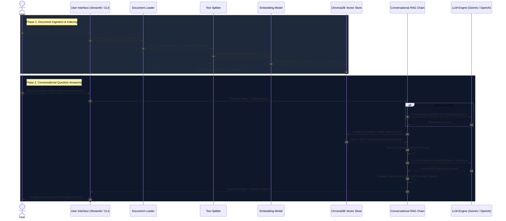

# Document Processing & RAG Retrieval Flow Diagram

This diagram illustrates the step-by-step data flow during **Document Ingestion** and **Conversational Query Answering**.

```mermaid
sequenceDiagram
    autonumber
    actor User
    participant UI as User Interface (Streamlit / CLI)
    participant Loader as Document Loader
    participant Splitter as Text Splitter
    participant Embedder as Embedding Model
    participant Chroma as ChromaDB Vector Store
    participant Chain as Conversational RAG Chain
    participant LLM as LLM Engine (Gemini / OpenAI)

    rect rgb(30, 41, 59)
    note right of User: Phase 1: Document Ingestion & Indexing
    User->>UI: Upload File (PDF, DOCX, TXT, Excel/CSV)
    UI->>Loader: Load document content & metadata
    Loader->>Splitter: Split into chunks (chunk_size=1000, overlap=200)
    Splitter->>Embedder: Generate vector embeddings for chunks
    Embedder->>Chroma: Store embeddings & metadata in ChromaDB collection
    Chroma-->>UI: Confirm indexing status & chunk count
    end

    rect rgb(15, 23, 42)
    note right of User: Phase 2: Conversational Question Answering
    User->>UI: Submit Question ("Who is the RAG Architect?")
    UI->>Chain: Process Query + Chat History
    alt History Exists
        Chain->>LLM: Reformulate question into standalone query
        LLM-->>Chain: Standalone Query
    end
    Chain->>Chroma: Perform Similarity / MMR Search (k=4)
    Chroma-->>Chain: Return Top-K Relevant Document Chunks
    Chain->>Chain: Format Context + System Prompt
    Chain->>LLM: Send Grounded Prompt (Context + Question)
    LLM-->>Chain: Generated Response Answer
    Chain->>Chain: Update Chat Memory & Extract Source Citations
    Chain-->>UI: Display Answer + Source Citations
    UI-->>User: Render Response & Expandable Sources
    end
```
