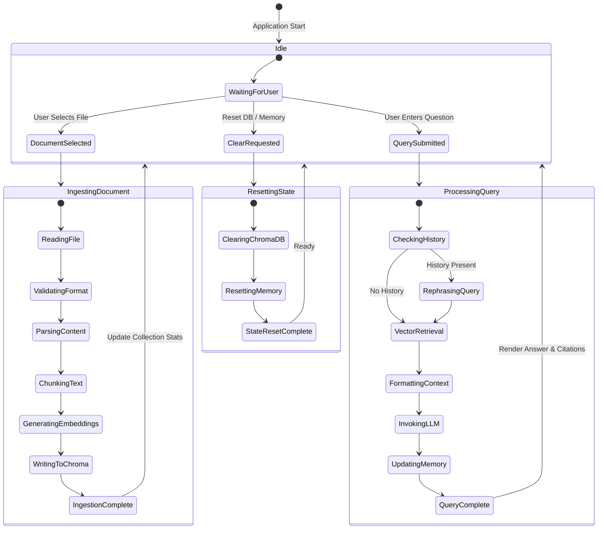

# System State Transition Diagram

This state diagram depicts the state transitions of the Conversational RAG Chatbot application from initialization to document ingestion, query execution, vector store resetting, and memory management.

