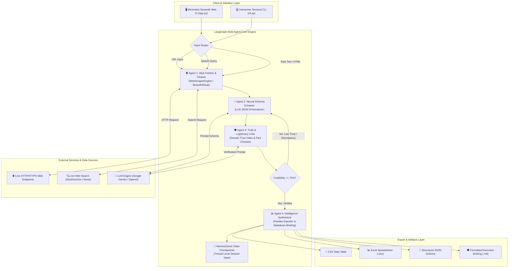

# 🏗️ EDRIC System Architecture Diagram

```mermaid
graph TD
    subgraph Client_Layer ["Client & Interface Layer"]
        UI["🖥️ Minimalist Streamlit Web UI (app.py)"]
        CLI["💻 Interactive Terminal CLI (cli.py)"]
    end

    subgraph LangGraph_Core ["LangGraph Multi-Agent Core Engine"]
        Router{"Input Router"}
        
        Node1["🕷️ Agent 1: Web Fetcher & Cleaner<br/>(WebScraperEngine / BeautifulSoup)"]
        Node2["🧠 Agent 2: Neural Schema Extractor<br/>(LLM JSON Schematizer)"]
        Node3["🛡️ Agent 3: Truth & Legitimacy Critic<br/>(Domain Trust Index & Fact Checker)"]
        Node4["📊 Agent 4: Intelligence Synthesizer<br/>(Pandas Exporter & Markdown Briefing)"]
        
        ReflectCheck{"Credibility >= 75%?"}
        Memory["💾 MemorySaver State Checkpointer<br/>(Thread-Level Session State)"]
    end

    subgraph External_Layer ["External Services & Data Sources"]
        LiveWeb["🌐 Live HTTP/HTTPS Web Endpoints"]
        SearchAPI["🔍 Live Web Search (DuckDuckGo / News)"]
        LLMProvider["🤖 LLM Engine (Google Gemini / OpenAI)"]
    end

    subgraph Output_Layer ["Export & Artifacts Layer"]
        CSV["📑 CSV Data Table"]
        Excel["📊 Excel Spreadsheet (.xlsx)"]
        JSON["🌳 Structured JSON Schema"]
        Briefing["🛡️ Formatted Executive Briefing (.md)"]
    end

    UI --> Router
    CLI --> Router

    Router -->|URL Input| Node1
    Router -->|Search Query| Node1
    Router -->|Raw Text / HTML| Node1

    Node1 <-->|HTTP Request| LiveWeb
    Node1 <-->|Search Request| SearchAPI
    Node1 --> Node2

    Node2 <-->|Prompt Schema| LLMProvider
    Node2 --> Node3

    Node3 <-->|Verification Prompt| LLMProvider
    Node3 --> ReflectCheck

    ReflectCheck -->|No: Low Trust / Discrepancy| Node2
    ReflectCheck -->|Yes: Verified| Node4

    Node4 --> Memory
    Node4 --> CSV
    Node4 --> Excel
    Node4 --> JSON
    Node4 --> Briefing
```
