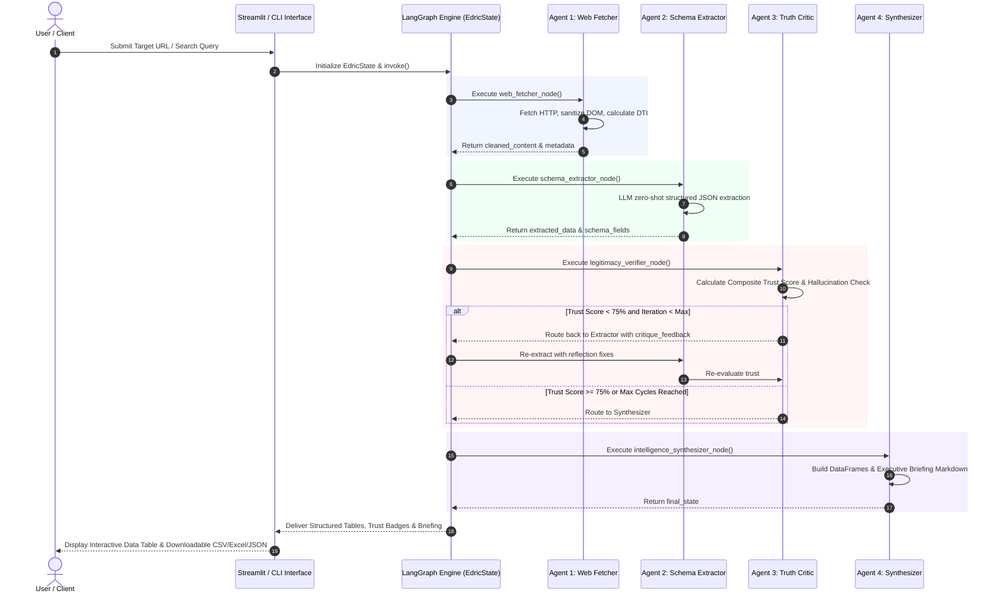

# 🔄 EDRIC Execution & Scraping Flow Diagram

```mermaid
sequenceDiagram
    autonumber
    actor User as User / Client
    participant UI as Streamlit / CLI Interface
    participant Graph as LangGraph Engine (EdricState)
    participant Fetcher as Agent 1: Web Fetcher
    participant Extractor as Agent 2: Schema Extractor
    participant Verifier as Agent 3: Truth Critic
    participant Synthesizer as Agent 4: Synthesizer

    User->>UI: Submit Target URL / Search Query
    UI->>Graph: Initialize EdricState & invoke()
    
    rect rgb(240, 245, 255)
        Graph->>Fetcher: Execute web_fetcher_node()
        Fetcher->>Fetcher: Fetch HTTP, sanitize DOM, calculate DTI
        Fetcher-->>Graph: Return cleaned_content & metadata
    end

    rect rgb(240, 255, 245)
        Graph->>Extractor: Execute schema_extractor_node()
        Extractor->>Extractor: LLM zero-shot structured JSON extraction
        Extractor-->>Graph: Return extracted_data & schema_fields
    end

    rect rgb(255, 245, 245)
        Graph->>Verifier: Execute legitimacy_verifier_node()
        Verifier->>Verifier: Calculate Composite Trust Score & Hallucination Check
        alt Trust Score < 75% and Iteration < Max
            Verifier-->>Graph: Route back to Extractor with critique_feedback
            Graph->>Extractor: Re-extract with reflection fixes
            Extractor->>Verifier: Re-evaluate trust
        else Trust Score >= 75% or Max Cycles Reached
            Verifier-->>Graph: Route to Synthesizer
        end
    end

    rect rgb(245, 240, 255)
        Graph->>Synthesizer: Execute intelligence_synthesizer_node()
        Synthesizer->>Synthesizer: Build DataFrames & Executive Briefing Markdown
        Synthesizer-->>Graph: Return final_state
    end

    Graph-->>UI: Deliver Structured Tables, Trust Badges & Briefing
    UI-->>User: Display Interactive Data Table & Downloadable CSV/Excel/JSON
```
