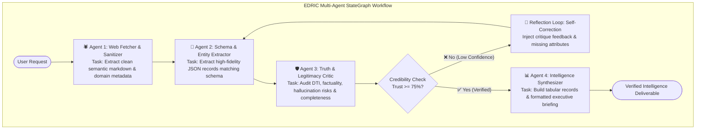

# 🤝 EDRIC Multi-Agent Collaboration & Reflection Workflow

```mermaid
flowchart TD
    subgraph Multi_Agent_Orchestration ["EDRIC Multi-Agent StateGraph Workflow"]
        Start([User Request]) --> Agent1["🕷️ Agent 1: Web Fetcher & Sanitizer<br/>Task: Extract clean semantic markdown & domain metadata"]
        
        Agent1 --> Agent2["🧠 Agent 2: Schema & Entity Extractor<br/>Task: Extract high-fidelity JSON records matching schema"]
        
        Agent2 --> Agent3["🛡️ Agent 3: Truth & Legitimacy Critic<br/>Task: Audit DTI, factuality, hallucination risks & completeness"]
        
        Agent3 --> Gate{"Credibility Check<br/>Trust >= 75%?"}
        
        Gate -- "❌ No (Low Confidence)" --> Refine["🔄 Reflection Loop: Self-Correction<br/>Inject critique feedback & missing attributes"]
        Refine --> Agent2
        
        Gate -- "✅ Yes (Verified)" --> Agent4["📊 Agent 4: Intelligence Synthesizer<br/>Task: Build tabular records & formatted executive briefing"]
        
        Agent4 --> Complete([Verified Intelligence Deliverable])
    end
```
