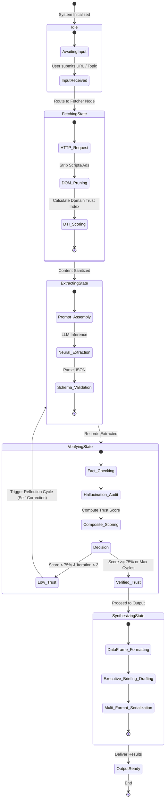

# 🔄 EDRIC LangGraph State Transition Diagram

```mermaid
stateDiagram-v2
    [*] --> Idle: System Initialized

    state Idle {
        [*] --> AwaitingInput
        AwaitingInput --> InputReceived: User submits URL / Topic
    }

    InputReceived --> FetchingState: Route to Fetcher Node

    state FetchingState {
        [*] --> HTTP_Request
        HTTP_Request --> DOM_Pruning: Strip Scripts/Ads
        DOM_Pruning --> DTI_Scoring: Calculate Domain Trust Index
        DTI_Scoring --> [*]
    }

    FetchingState --> ExtractingState: Content Sanitized

    state ExtractingState {
        [*] --> Prompt_Assembly
        Prompt_Assembly --> Neural_Extraction: LLM Inference
        Neural_Extraction --> Schema_Validation: Parse JSON
        Schema_Validation --> [*]
    }

    ExtractingState --> VerifyingState: Records Extracted

    state VerifyingState {
        [*] --> Fact_Checking
        Fact_Checking --> Hallucination_Audit
        Hallucination_Audit --> Composite_Scoring: Compute Trust Score
        Composite_Scoring --> Decision
        
        state Decision <<choice>>
        Decision --> Low_Trust: Score < 75% & Iteration < 2
        Decision --> Verified_Trust: Score >= 75% or Max Cycles
    }

    Low_Trust --> ExtractingState: Trigger Reflection Cycle (Self-Correction)
    Verified_Trust --> SynthesizingState: Proceed to Output

    state SynthesizingState {
        [*] --> DataFrame_Formatting
        DataFrame_Formatting --> Executive_Briefing_Drafting
        Executive_Briefing_Drafting --> Multi_Format_Serialization
        Multi_Format_Serialization --> [*]
    }

    SynthesizingState --> OutputReady: Deliver Results
    OutputReady --> [*]: End
```
